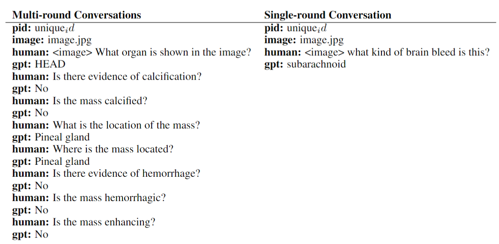
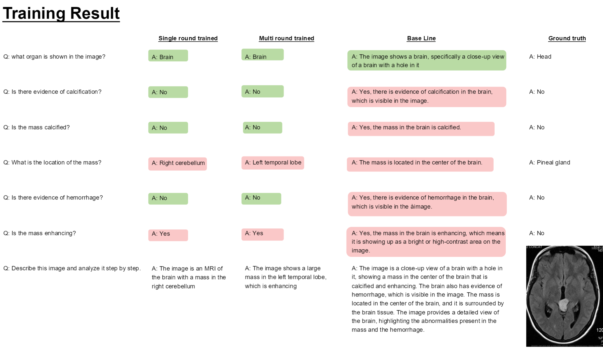

Due to the limitation of the github i can't upload the results of our fine-tunning (.pth and hf) files.
If you need please let me know.
I try to write evey details in the below text.
# Train the llava in medical area


## Training Flow


## Training Process


## Chat


## Model Prepare

### Download the LLaVA-LLaMA-3-8B
[https://huggingface.co/xtuner/llava-llama-3-8b](https://huggingface.co/xtuner/llava-llama-3-8b)

### Download the VLIP-ViT-Large-P-14-336
[https://huggingface.co/openai/clip-vit-large-patch14-336](https://huggingface.co/openai/clip-vit-large-patch14-336)

### Download the Toolkit
[Xtuner](https://github.com/InternLM/xtuner/tree/main)

Please use version=0.2.20

## Data Prepare

### Download VQA-RAD
[VQA-RAD](https://huggingface.co/datasets/flaviagiammarino/vqa-rad)

### Process the Data and Augment
- Split the data into train and test groups
- Make two different types of data: single-round conversation and multi-round conversations
- 

<details>
<summary>Example</summary>

```json
[
  {
    "id": "000000033471",
    "image": "coco/train2017/000000033471.jpg",
    "conversations": [
      {
        "from": "human",
        "value": "<image>\nWhat are the colors of the bus in the image?"
      },
      {
        "from": "gpt",
        "value": "The bus in the image is white and red."
      },
      {
        "from": "human",
        "value": "What feature can be seen on the back of the bus?"
      },
      {
        "from": "gpt",
        "value": "The back of the bus features an advertisement."
      },
      {
        "from": "human",
        "value": "Is the bus driving down the street or pulled off to the side?"
      },
      {
        "from": "gpt",
        "value": "The bus is driving down the street, which is crowded with people and other vehicles."
      }
    ]
  },
  {
    "id": "000000052846",
    "image": "coco/train2017/000000052846.jpg",
    "conversations": [
      {
        "from": "human",
        "value": "<image>\nWhere is the cat positioned in the image?"
      },
      {
        "from": "gpt",
        "value": "The cat is positioned on top of the back of the couch in the living room."
      }
    ]
  }
]
```
</details>

## Align the Image Input and Text Input
- Use the Map folder's files to replace the Xtuner's files
- Use the input align function to align the different modalities

## Train
Use the script file to fine-tune your model.

The training of LLaVA consists of two steps:
1. Alignment module (i.e., MLP) pretraining
2. Instruction following fine-tuning

### Model Conversion (and Merge)

After training, we will obtain a set of weights (*i.e.*, `iter_xxx.pth`), which are not in the universal HuggingFace format. We first need to convert them:

```bash
xtuner convert pth_to_hf $FINETUNE_CFG $PTH_PATH $SAVE_PATH
```

At this point, we have obtained the relevant model (LLM or the corresponding LoRA).

Afterwards, if you want to merge LoRA into LLM or CLIP-ViT, please use the following command:

```bash
# LLM
xtuner convert merge $LLM $LLM_ADAPTER $SAVE_PATH

# CLIP
xtuner convert merge $CLIP $CLIP_ADAPTER $SAVE_PATH --is-clip
```

## Evaluation
Evaluate the model on the test dataset and on [MMBench](https://github.com/open-compass/MMBench)

```bash
xtuner mmbench internlm/internlm2-chat-7b \
  --visual-encoder openai/clip-vit-large-patch14-336 \
  --llava xtuner/llava-internlm2-7b \
  --prompt-template internlm2_chat \
  --data-path $DATA_PATH \
  --work-dir $RESULT_PATH
```

## Chat
```bash
xtuner chat internlm/internlm2-chat-7b \
  --visual-encoder openai/clip-vit-large-patch14-336 \
  --llava xtuner/llava-internlm2-7b \
  --prompt-template internlm2_chat \
  --image $IMAGE_PATH
```
## Result

## Appendix
- PyTorch Version = 3.10

### Fine-Tune Parameters

| Hyper Parameter | Single-Round-LoRA-Fine-Tune | Multi-Round-LoRA-Fine-Tune | Single-Round-QLoRA | Multi-Round-QLoRA | Single-Round-Freeze | Multi-Round-Freeze |
|----------------|:----------------------------|:----------------------------|:-------------------|:------------------|:-------------------|:-------------------|
| Batch Size | 1 | 1 | 8 | 8 | 8 | 8 |
| Accumulative Gradients | 1 | 1 | 128 | 128 | 2 | 2 |
| Number of Dataloader Workers | 1 | 1 | 4 | 4 | 4 | 4 |
| Maximum Epochs | 1 | 1 | 1 | 1 | 1 | 1 |
| Learning Rate | 5e-5 | 5e-5 | 1e-4 | 1e-4 | 5e-4 | 5e-4 |
| Optimizer Type | AdamW | AdamW | AdamW | AdamW | AdamW | AdamW |
| Weight Decay | 0 | 0 | 0 | 0 | 0 | 0 |
| Gradient Clipping Max Norm | 1 | 1 | 5 | 5 | 1 | 1 |
| Warmup Ratio | 0.03 | 0.03 | 0.03 | 0.03 | 0.03 | 0.03 |
| LoRA Rank (r) | 8 | 8 | 64 | 64 | - | - |
| LoRA Alpha | 8 | 8 | 16 | 16 | - | - |
| LoRA Dropout | 0.1 | 0.1 | 0.05 | 0.05 | - | - |
| LoRA Bias | none | none | none | none | none | none |
| Main Phase | CosineAnnealingLR (η_min=0.0) | CosineAnnealingLR (η_min=0.0) | CosineAnnealingLR (η_min=0.0) | CosineAnnealingLR (η_min=0.0) | CosineAnnealingLR (η_min=0.0) | CosineAnnealingLR (η_min=0.0) |
| LoRA | r=8, alpha=8 | r=8, alpha=8 | r=64, alpha=16 | r=64, alpha=16 | - | - |
| Quantization | - | - | 4-bit | 4-bit | - | - |
| Freeze Strategy | freeze-llm=True, freeze-visual-encoder=True | freeze-llm=True, freeze-visual-encoder=True | freeze-llm=True, freeze-visual-encoder=True | freeze-llm=True, freeze-visual-encoder=True | freeze-llm=True, freeze-visual-encoder=True | freeze-llm=True, freeze-visual-encoder=True |
